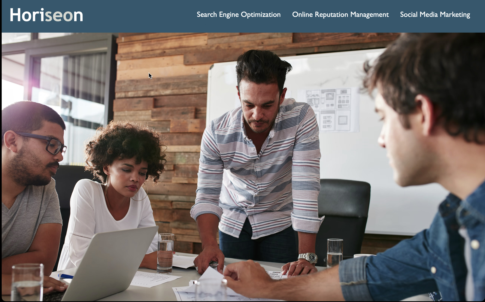

# Horiseon Accessibility Rework

I was given a base HTML code and CSS stylesheet and I reworked the codes so that they follow accessability standards and optimized the site for search engines. 

## Languages and tools:
* HTML
* CSS
* VS Code


[Horiseon](targetURL "https://teedaa.github.io/horiseon-accesbility-rework/")

```
.benefit-lead, .benefit-brand, .benefit-cost, {
    margin-bottom: 32px;
    color: #ffffff;
}

.benefit-lead h3, .benefit-brand h3, .benefit-cost h3 {
    margin-bottom: 10px;
    text-align: center;
}

.benefit-lead img, .benefit-brand img, .benefit-cost img{
    display: block;
    margin: 10px auto;
    max-width: 150px;
}
```
# Credits
Pengteda Cheng
[Github](targetURL "https://github.com/teedaa")
